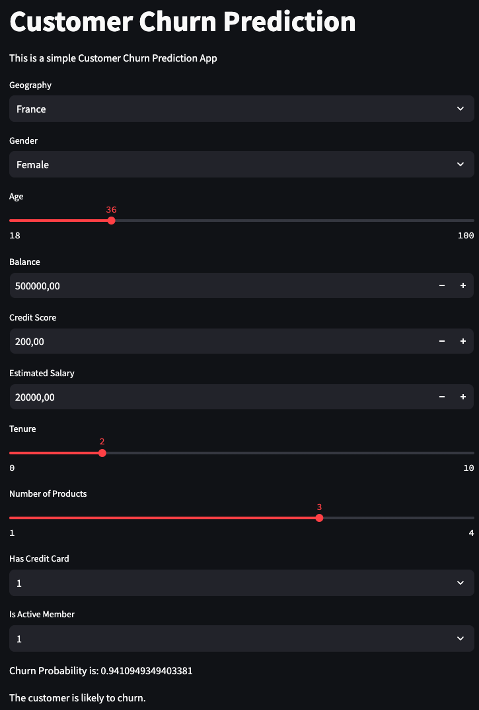

# ANN-Classification-Churn

This repository provides an artificial neural network (ANN) model to predict customer churn based on various scores. The model can be run via Streamlit, allowing users to manually change volumes and values for dynamic predictions.

## Table of Contents
- [Overview](#overview)
- [Installation](#installation)
- [Usage](#usage)
- [Model](#model)
- [Features](#features)
- [Contributing](#contributing)
- [License](#license)

## Overview
Customer churn prediction is essential for businesses to retain their customers. This project employs an artificial neural network (ANN) to predict whether a customer will churn based on different input scores. By using Streamlit, users can interactively adjust the input values to see the impact on the predictions.

## Installation
1. Clone the repository:
    ```bash
    git clone https://github.com/Tafehi/ANN-Classification-Churn.git
    ```
2. Navigate to the project directory:
    ```bash
    cd ANN-Classification-Churn
    ```
3. Install the required packages:
    ```bash
    pip install -r requirements.txt
    ```

## Usage
1. Run the Streamlit app:
    ```bash
    streamlit run app.py
    ```
2. Open your web browser and go to `http://localhost:8501` to interact with the app.

3. In below you can see the application when it is running.


## Model
The model is built using an artificial neural network (ANN) that takes various scores as input features and predicts customer churn. The training process and model architecture are detailed in the `app.py` script.

## Features
- **Interactive Predictions:** Users can manually adjust input values to see how the predictions change.
- **Dynamic Visualization:** Real-time updates of the prediction results.
- **User-Friendly Interface:** Simple and intuitive web app powered by Streamlit.

## Contributing
Contributions are welcome! Please fork the repository and submit a pull request for any improvements or bug fixes.

## License
This project is licensed under the MIT License. See the `LICENSE` file for details.
